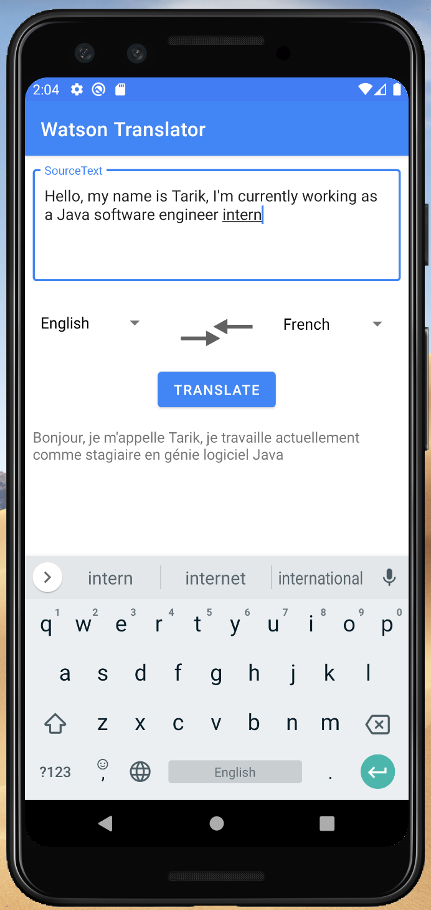
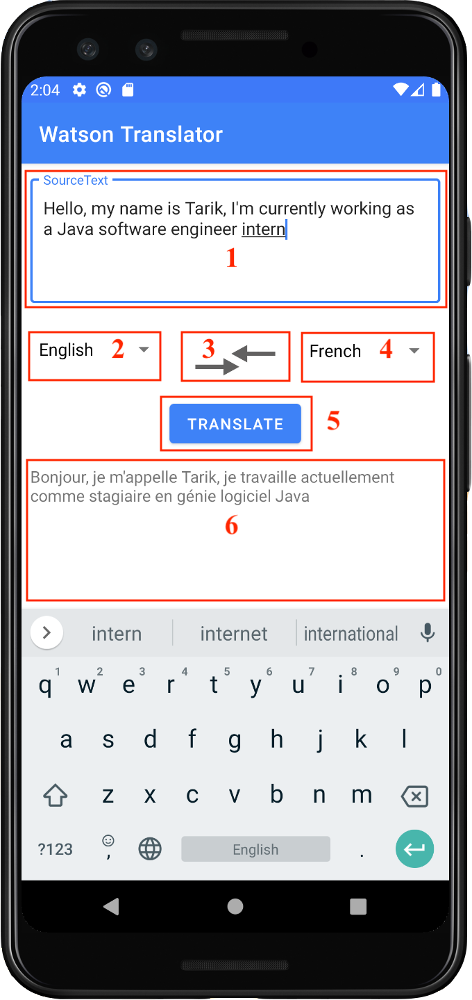

# AIT Translator

## About
The aim of this project is to develop an Android application that uses IBM’s Watson Language Translator service to translate text from a source to a target language. 
Translation is available among Arabic, Chinese, English, French, Portuguese, German, and Spanish.
The application uses the Material design system for the user interface design. 
We test our application using JUnit, Mockito and Espresso at three different levels: 
Markup : * Local Unit Tests
		 * Instrumented Tests
		 * UI Tests

  
   

