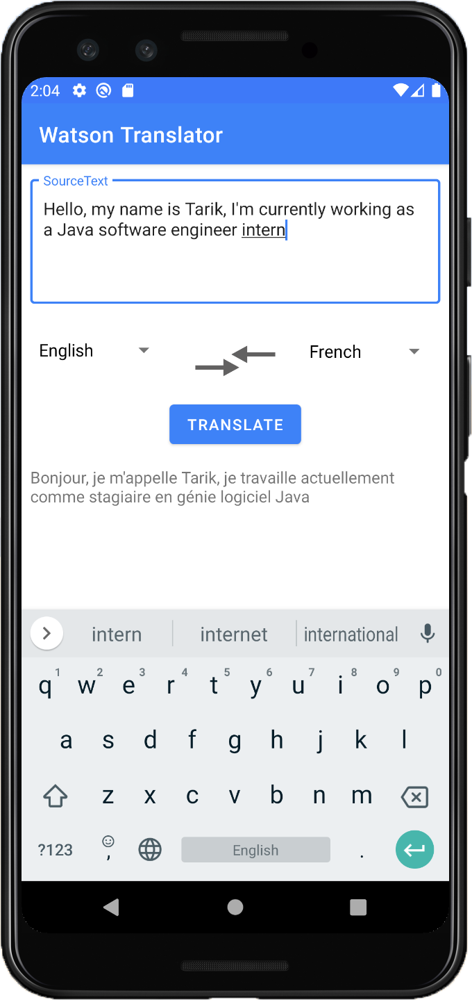

# AIT Translator

## Abstract
The aim of this project is to develop an Android application that uses IBM’s Watson Language Translator service to translate text from a source to a target language. 

Translation is available among Arabic, Chinese, English, French, Portuguese, German, and Spanish.
The application uses the Material design system for the user interface design. 

We test our application using JUnit, Mockito and Espresso at three different levels: 
* Local Unit Tests
* Instrumented Tests
* UI Tests

 

 Our application is composed of the following UI components: 
 <pre>

</pre>

  

**UI Component 1:** TextInput where the user submits the text to be translated.  
**UI Component 2 & 4:** Spinner that displays a list of available source and target languages respectively.  
**UI Component 3:** Button that allows user to switch the source language with the target language. 
**UI Component 5:** Button that starts the service which translates the textUI.  
**UI Component 6:** TextView to show the final result.  

## Local unit tests
In unit testing, we test the individual functions of some classes. Those tests are run on our machine's local Java Virtual Machine (JVM).  

 

In the screen we see that test classes are organized in their own package, Those tests are run using JUnit4.  

In this test, we test the connectivity to the ibm cloud service, and the translate function.  

The test results are shown down, (Tests passed: 2)  

## Instrumented tests
With instrumented testing we are able to verify app logic that needs a real device, so mostly we will verify the UI. We used junit and Espresso.  
 
 

In this instrumented test, we submitted some text in the input field, verified that it was indeed written, changed both source and target languages and gave them the same values, clicked on the translate button,then we verified that an error alert is shown as the source and target languages cannot be the same, and finally we verified that the button is still displayed.

## UI tests
User interface (UI) testing lets us ensure that our application meets its functional requirements. UI tests are a complete use cases to simulate user interaction with the application:

 

In this Ui test, we submitted some text in the input field, verified that it was indeed written, changed both source and target languages, clicked on the translate button to start the background task, and finally we verified that result is displayed in its respective text view.  

We changed the languages again, and repeated the same scenario again just to double check.  

